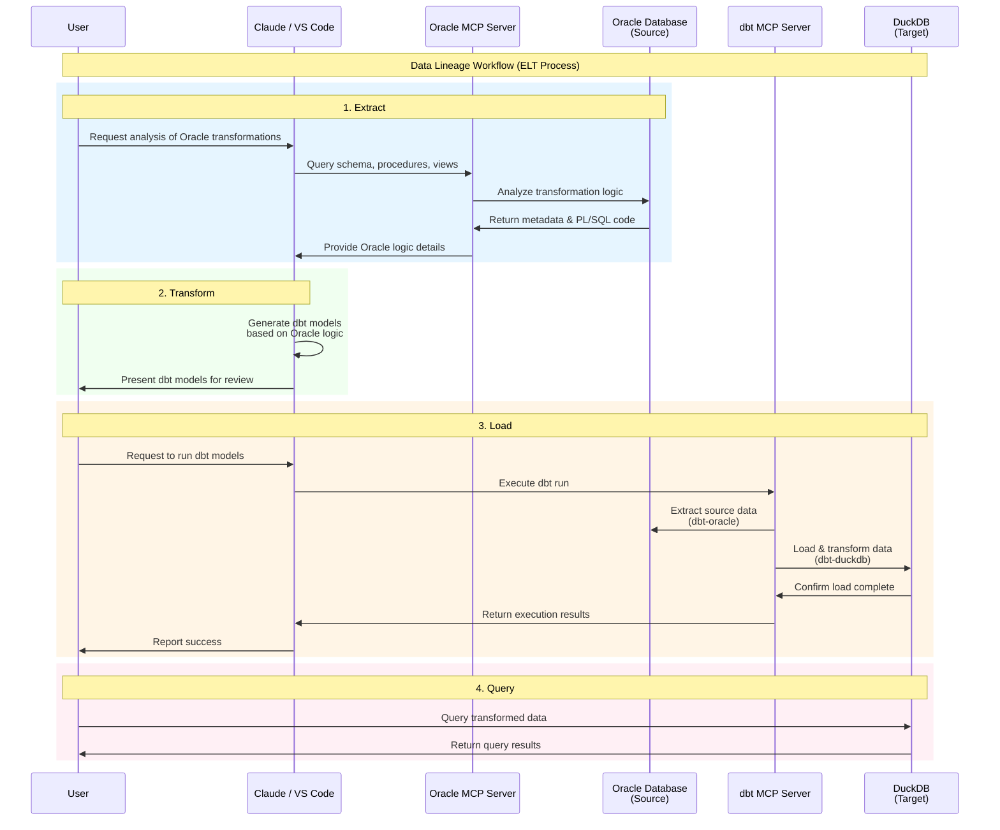
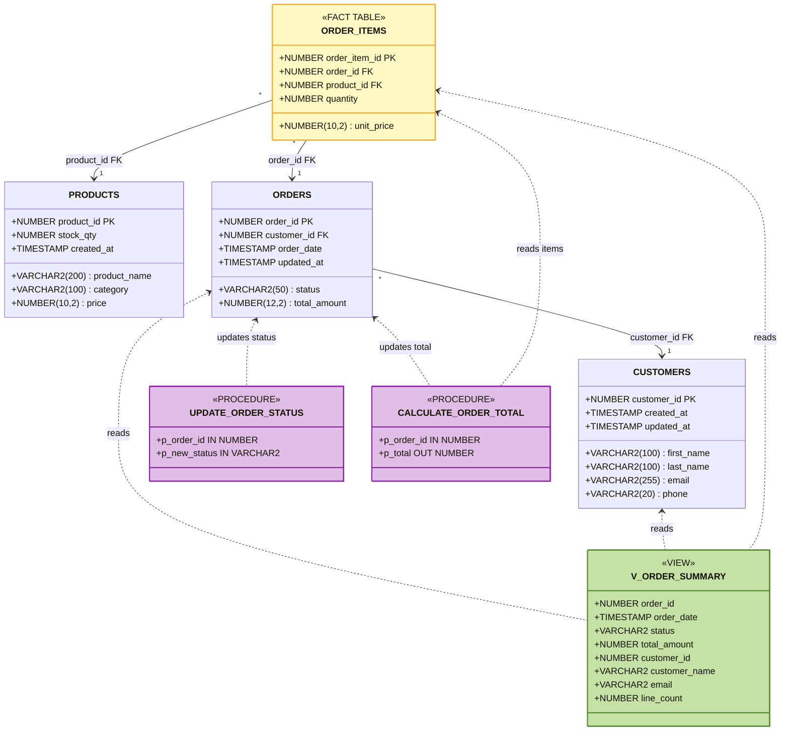

# Data lineage agent

> [!IMPORTANT]
> The infrastructure of the local dev environment includes the Oracle database and DuckDB to mimic the goal to `extract the transformation logic from one database and write them down in dbt for future migration` as an example.
>
> In production, you don't need these databases. You only need MCP servers.

## Table of contents

- [Data lineage agent](#data-lineage-agent)
  - [Table of contents](#table-of-contents)
  - [Getting started](#getting-started)
  - [Infrastructure](#infrastructure)
  - [Oracle (Source)](#oracle-source)
    - [Overview](#overview)
    - [Sample data](#sample-data)
    - [Connect to Oracle](#connect-to-oracle)
  - [DuckDB (Target)](#duckdb-target)
    - [Overview](#overview-1)
    - [Connect to DuckDB](#connect-to-duckdb)
  - [dbt project structure](#dbt-project-structure)
    - [Usage](#usage)
  - [Connect MCP clients](#connect-mcp-clients)
    - [Claude Desktop (macOS)](#claude-desktop-macos)
    - [VS Code (Claude Code extension)](#vs-code-claude-code-extension)
  - [Using the MCP servers](#using-the-mcp-servers)
  - [Visualizing data lineage in dbt](#visualizing-data-lineage-in-dbt)
  - [References](#references)

## Getting started

1. You need to create `.env` file with updated values:

```shell
# Copy the example environment variables file
cp .env.example .env

# Edit .env with your values
vim .env
```

For the dummy database example, you can directly use below `.env`:

```shell
# Oracle database username
ORACLE_USERNAME=testuser

# Oracle database password
ORACLE_PASSWORD=TestPassword123

# Oracle schema
ORACLE_SCHEMA=TESTUSER

# Read-only mode: 1 = SELECT only (default); 0 = allow writes
READ_ONLY_MODE=1
```

2. With [Docker Desktop](https://www.docker.com/products/docker-desktop/) running, execute the following command to spin up the agent environment:

```shell
docker compose up --build
```

3. Finally, check if all containers are running successfully:

```shell
docker compose ps
# All containers should show "Up" and oracle-db should be "healthy"
```

```shell
✅ oracle-db    - Oracle Database Free 23ai (healthy, port 1521)
✅ duckdb       - DuckDB Database
✅ oracle-mcp   - Oracle MCP Server
✅ dbt-mcp      - dbt MCP Server with Oracle support
```

## Infrastructure



The infrastructure reflects the following workflow:
* **Extract**: Use Oracle MCP to analyze Oracle database transformation logic
* **Transform**: Use Claude to create dbt models based on Oracle logic
* **Load**: Run dbt models against DuckDB (default target)
* **Query**: Query data directly from DuckDB

## Oracle (Source)

### Overview

- **Host**: localhost:1521
- **Service**: FREE
- **System User**: system / TestPassword123
- **Application User**: testuser / TestPassword123
- **Schema**: TESTUSER

### Sample data

The sample data is initialized during the creation of an Oracle database instanace with [init.sql](./seed/01_init.sql). It follows the star schema with `ORDER_ITEMS` as fact table, and `ORDERS`, `CUSTOMERS` and `PRODUCTS` as dimension tables. It also has a view `V_ORDER_SUMMARY` that serves reporting.

The class diagram is as below:



### Connect to Oracle

After `oracle-db` is up and running via `docker compose`, you can connect to it and run queries with the following steps:

1. Connect to Oracle via `sqlplus`:

```shell
docker exec -it oracle-db sqlplus testuser/TestPassword123@//localhost:1521/FREE
```

2. You can check the tables with the following queries:

```sql
SQL> SELECT table_name FROM user_tables;
-- Shows: CUSTOMERS, ORDERS, ORDER_ITEMS, PRODUCTS

SQL> SELECT * FROM customers;
SQL> SELECT * FROM orders;
SQL> EXIT;
```

## DuckDB (Target)

### Overview

- **Database File**: `/data/oracle_lineage.duckdb` (inside container)
- **Volume**: `duckdb-data` (persistent)
- **Schema**: main
- **Access**: Via docker exec or port 3000 (web UI if available)

### Connect to DuckDB

After `duckdb` is up and running via `docker compose`, you can connect to it and run queries with the following steps:

1. Connect to DuckDB:

```shell
docker exec -it duckdb duckdb /data/oracle_lineage.duckdb
```

2. Once inside, you can run SQL queries:

```sql
-- Show all tables
SHOW TABLES;

-- Exit
.quit
```

> [!TIP]
> You can also run a single query:
> 
> ```shell
> docker exec -it duckdb duckdb /data/oracle_lineage.duckdb -c "SHOW TABLES;"
> ```

> [!TIP]
> you can also run from a SQL file:
> 
> ```shell
> docker exec -i duckdb duckdb /data/oracle_lineage.duckdb < your_query.sql
> ```

> [!TIP]
> You can also list all the tables using the following query.
> 
> If no ETL has been performed by `dbt run` as shown in the next section [dbt Project Structure](#dbt-project-structure), there should be no tables:
>
>```shell
> docker exec -it duckdb duckdb /data/oracle_lineage.duckdb -c "
> SELECT 
>   table_schema,
>   table_name,
>   COUNT(*) as row_count
> FROM information_schema.tables 
> WHERE table_schema = 'main'
> GROUP BY table_schema, table_name;
> "
>```

## dbt project structure

> [!IMPORTANT]
> All the `schema.yml` and `everything.sql` files are generated by Claude Code after using MCP servers in [Using the MCP Servers](#using-the-mcp-servers).

```tree
├── dbt_project
│   ├── dbt_project.yml                 # dbt project configuration
│   ├── models
│   │   ├── marts
│   │   │   ├── mart_order_summary.sql  # mart model for order summary
│   │   │   └── schema.yml              # schema for mart models
│   │   └── staging
│   │       ├── schema.yml              # schema and source definitions for staging models
│   │       ├── stg_customers.sql       # Staging model for customers
│   │       ├── stg_order_items.sql     # Staging model for order items
│   │       └── stg_orders.sql          # Staging model for orders
│   ├── profiles
│   │   └── profiles.yml                # Connection profiles:
                                        #   - oracle_source (extract logic)
                                        #   - duckdb (default target)
```

### Usage

1. You need to create all the source tables in DuckDB first before doing the transformation:

```shell
docker exec dbt-mcp python3 /dbt_project/load_oracle_to_duckdb.py
```

2. After you've created the source tables, you can show them under the schema `testuser`:

```shell
docker exec -it duckdb duckdb /data/oracle_lineage.duckdb -c "SHOW TABLES FROM 'testuser'"
```

3. You can materialize a selected view via `dbt run --select` one by one:

```shell
# Run staging model for customers
docker exec -it dbt-mcp dbt run --select stg_customers

# Run staging model for order items
docker exec -it dbt-mcp dbt run --select stg_order_items

# Run staging model for orders
docker exec -it dbt-mcp dbt run --select stg_orders

# Run mart model for order summary
docker exec -it dbt-mcp dbt run --select mart_order_summary
```

Or you can do it in one go:

```shell
docker exec -it dbt-mcp dbt run
```

4. Finally, you can play around with all the tables in DuckDB by connecting to it:

```shell
docker exec -it duckdb duckdb /data/oracle_lineage.duckdb
```

Once inside, you can run SQL queries:

```sql
-- Query your dbt models after `dbt run --select stg_customers`
SELECT * FROM main.stg_customers;

-- Query your dbt models after `dbt run --select stg_order_items`
SELECT * FROM main.stg_order_items;

-- Query your dbt models after `dbt run --select stg_orders`
SELECT * FROM main.stg_orders;

-- Query your dbt models after `dbt run --select mart_order_summary`
SELECT * FROM main.mart_order_summary;

-- Exit
.quit
```

## Connect MCP clients

You can either use [Claude Desktop](https://code.claude.com/docs/en/desktop-quickstart) or the VS Code with Claude Code Extension as the MCP client. 

After the following setup, you can chat with the Oracle database and use dbt to codify the transformation logic for the future migration to another database (here, we use DuckDB for a quick example).

### Claude Desktop (macOS)

Add to `claude_desktop_config.json`:

```json
{
  "mcpServers": {
    "oracle": {
      "command": "docker",
      "args": ["exec", "-i", "oracle-mcp", "python", "main.py"]
    },
    "dbt": {
      "command": "docker",
      "args": ["exec", "-i", "dbt-mcp", "dbt-mcp"]
    }
  }
}
```

Then restart Claude Desktop.

### VS Code (Claude Code extension)

Update [.mcp.json](./.mcp.json) with below settings:

```json
{
  "mcpServers": {
    "oracle": {
      "command": "docker",
      "args": ["exec", "-i", "oracle-mcp", "python", "main.py"]
    },
    "dbt": {
      "command": "docker",
      "args": ["exec", "-i", "dbt-mcp", "dbt-mcp"]
    }
  }
}
```

## Using the MCP servers

How this tool works from end to end looks like below:

https://github.com/user-attachments/assets/ed3b7c3b-2caf-4811-8289-4e21c2351337

Once both MCP servers are connected to your AI assistant:

1. **Explore the Oracle schema**
   > "Use oracle-mcp to show me all tables in the TESTUSER schema"

2. **Inspect transformation logic**
   > "Get the source of the UPDATE_ORDER_STATUS procedure"
   
   > "Show me the SQL logic for calculating order totals"

3. **Generate dbt models**
   > "Use dbt-mcp to generate a staging model for TESTUSER.ORDERS"
   
   > "Generate source YAML for all tables in TESTUSER schema"

4. **Run models in DuckDB**
   > "Run dbt against the DuckDB target"

   The dbt profile is configured to use DuckDB as the default target, so models will be materialized in DuckDB.

5. **Query results from DuckDB**
   After running dbt, you can query the results from DuckDB:
   ```bash
   docker exec -it duckdb duckdb /data/oracle_lineage.duckdb
   ```

   Then run queries:
   ```sql
   SELECT * FROM main.stg_orders;
   SELECT * FROM main.stg_customers;
   ```

6. **Switch targets if needed**
   To run against Oracle source (for comparison):
   > "Run dbt with --target oracle_source"

## Visualizing data lineage in dbt

1. Generate the docs:

```shell
docker exec -it dbt-mcp dbt docs generate
```

2. Serve the docs:

```shell
docker exec -it dbt-mcp dbt docs serve --host 0.0.0.0 --port 8080
```

3. Select and show a specific table's upstream or downstream dependencies:

```shell
docker exec dbt-mcp bash -c "cd /dbt_project && dbt ls --resource-type model"

# +model_name - Shows the model AND all its upstream ancestors
docker exec dbt-mcp bash -c "cd /dbt_project && dbt ls --select +mart_order_summary"

# +model_name --resource-type model - Shows ONLY upstream models (excludes sources and tests)
docker exec dbt-mcp bash -c "cd /dbt_project && dbt ls --select +mart_order_summary --resource-type model"

# +model_name --resource-type source - Shows ONLY upstream sources
docker exec dbt-mcp bash -c "cd /dbt_project && dbt ls --select +mart_order_summary --resource-type source"
```

> ![TIP]
> | Selector | Description |
> |----------|-------------|
> | `model_name` | Select only the specified model |
> | `+model_name` | Model + all upstream ancestors (models, sources, tests) |
> | `1+model_name` | Model + 1 level upstream |
> | `2+model_name` | Model + 2 levels upstream |
> | `model_name+` | Model + all downstream descendants |
> | `model_name+1` | Model + 1 level downstream |
> | `model_name+2` | Model + 2 levels downstream |
> | `+model_name+` | Model + all upstream AND downstream |
> | `1+model_name+1` | Model + 1 level upstream + 1 level downstream |
> | `tag:my_tag` | All models with the specified tag |
> | `path:models/staging` | All models in the specified path |
> | `model_a model_b` | Union: select model_a OR model_b |
> | `model_a,model_b` | Intersection: select model_a AND model_b |
> | `@model_name` | Model + all direct parents and children |

## References

* https://hub.docker.com/r/gvenzl/oracle-free#docker-compose
* https://hub.docker.com/r/duckdb/duckdb/
* https://github.com/danielmeppiel/oracle-mcp-server
* https://github.com/googleapis/mcp-toolbox
* https://github.com/oracle/mcp
* https://github.com/dbt-labs/dbt-mcp
